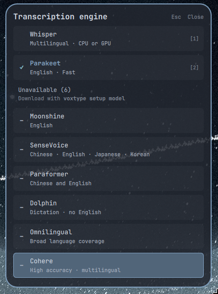
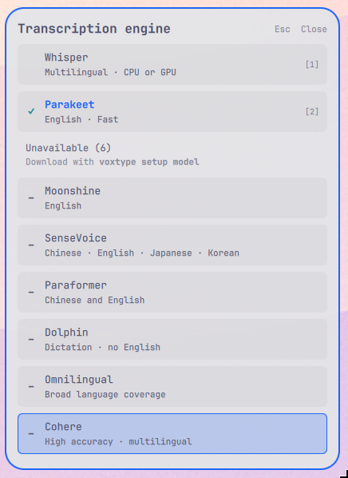
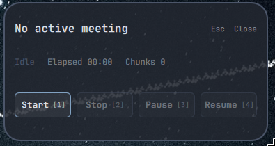

# VoxType OSD HUD for Omarchy Quattro

A floating, click-through voice HUD for [VoxType](https://voxtype.io) that automatically matches your Omarchy theme, with a smooth animated reveal on every theme switch.


`blizl.voxtype-osd` is a clean-architecture Omarchy Quattro plugin providing a modern floating capsule HUD on-screen display (OSD), dynamic equalizer visualizer, live theme synchronization, engine switcher, and meeting controls for VoxType.

---

## Features

- **Modern Floating Capsule HUD**: Sleek, glassy pill design matching the Omarchy Nord aesthetic with glassmorphic translucent backdrops (`#2e3440` base with `#88c0d0` Frost accents).
- **Responsive Dynamic Equalizer**: 16-bar animated audio equalizer driven by real-time audio socket peaks and RMS levels with organic micro-jitter and bounce physics.
- **Harmonic AI Wave Animation**: Smooth traveling sine-wave visualizer active during AI transcription phases.
- **Multi-State Feedback**:
  - 🔴 **Recording**: Pulsing Nord scarlet indicator + live elapsed timer (`0:14`) + dynamic equalizer.
  - 🔵 **Streaming**: Nord Frost cyan glow with live voice activity.
  - 🟡 **Transcribing**: Nord amber glow + animated traveling wave.
  - 🟢 **Voice Activity (VAD)**: Dynamic green halo trigger on active speech.
- **Animated Theme Transitions**: When the active Omarchy theme changes, the OSD plays a short masked reveal wipe — mirroring Omarchy's own wallpaper transition — instead of an abrupt colour flip, with a brief "peek" to confirm the change even while hidden. Reveal geometry is configurable (`omarchy` / `grow` / `wipe-right` / `wipe-left` / `fade` / `none`); see [Theme transitions](#theme-transitions).
- **Click-Through Wayland Overlay**: Transparent `WlrLayershell` overlay with mouse event pass-through mask so the HUD never intercepts cursor clicks.
- **Engine Picker Modal** (`SUPER + E`): Floating popup (`EnginePicker.qml`) to switch between Whisper, Parakeet, Moonshine, SenseVoice, Paraformer, Dolphin, Omnilingual, and Cohere engines on the fly. Engines are split into what is ready to use versus what still needs downloading, so the list reflects your machine.
- **Meeting Controls HUD** (`SUPER + M`): Floating controls panel (`MeetingControls.qml`) surfacing active meeting title, duration, chunk count, and Start / Pause / Resume / Stop triggers.
- **Atomic Rollback & Safety**: Full transactional backups, automated checkpoints, and clean uninstaller restoring previous configurations without leaving orphaned files.

### Engine Picker & Meeting Controls


The `SUPER + E` engine picker and `SUPER + M` meeting controls panel float over the desktop the same way the OSD does, and pick up theme changes live too.

The picker sizes itself from its contents, so the whole engine list fits on screen instead of clipping the last row, and it scrolls if a future engine would overflow. Each row carries a one-line capability blurb, and engines you have not downloaded stay visible under an **Unavailable** heading with the `voxtype setup model` command needed to fetch them.

| Nord (dark) | Catppuccin Latte (light) |
| :---: | :---: |
|  |  |

Secondary text uses the theme's `subtextColor`, and selected and hover fills are tuned separately for light and dark themes so row text stays readable either way. Meeting controls get the same treatment.

| Meeting controls (`SUPER + M`, Nord) |
| :---: |
|  |

---

## Requirements

| Dependency | Why | Notes |
| --- | --- | --- |
| [Omarchy](https://omarchy.org) (Quattro) on Hyprland | Plugin host, theme files (`~/.config/omarchy/current/theme/colors.toml`), `bindings.lua` | Tested on Omarchy Quattro |
| [VoxType](https://voxtype.io) ≥ 0.7 | The dictation daemon this HUD visualises | Setup sets `[osd] frontend = "quickshell"` in `~/.config/voxtype/config.toml` |
| [Quickshell](https://quickshell.outfoxxed.me) (`qs`) with Qt 6 `QtQuick.Effects` | Renders the layer-shell overlay and the masked theme reveal | Ships with Omarchy |
| `jq` | Install/uninstall record handling | Ships with Omarchy |

`bin/setup` checks for `jq`, `voxtype` and `qs` before touching anything. No files outside `~/.config/voxtype`, `~/.local/share/voxtype`, `~/.local/state/blizl.voxtype-osd` and (only with your consent) `~/.config/hypr/bindings.lua` are modified.

---

## Installation

### Via Omarchy Plugin Manager

```bash
omarchy plugin add https://github.com/Blizl/Omarchy-VoxType-OSD.git --enable \
  && ~/.config/omarchy/plugins/blizl.voxtype-osd/bin/setup
```

### Direct / Local Setup

```bash
git clone https://github.com/Blizl/Omarchy-VoxType-OSD.git
cd Omarchy-VoxType-OSD
./bin/setup
```

Pass `--yes` or `-y` for non-interactive automated installations (e.g. scripts or CI):

```bash
./bin/setup --yes
```

---

## Uninstallation & Recovery

### Uninstalling

#### Via Omarchy Plugin Manager

Run the plugin's uninstaller first (it restores your previous VoxType config, removes the installed Quickshell files and the `SUPER + E` / `SUPER + M` bindings), then remove the plugin itself:

```bash
~/.config/omarchy/plugins/blizl.voxtype-osd/bin/uninstall \
  && omarchy plugin remove blizl.voxtype-osd
```

`omarchy plugin remove` on its own only deletes the plugin folder — it does not know about the files `bin/setup` created, so always run `bin/uninstall` first.

#### Direct / Local Setup

From the cloned repository:

```bash
./bin/uninstall
```

Both paths revert only what setup changed: the `[osd]` section of `config.toml` goes back to its pre-install content (any other edits you made since are kept), the installed Quickshell files and the keybinding block are removed. Re-running `bin/setup` (e.g. after an update) keeps the original pre-install baseline, so uninstalling later still returns you to where you started.

### Recovery Utility

The included `bin/restore` utility allows rolling back configuration at any time:

```bash
# Revert to the pre-setup state:
./bin/restore --latest

# List available snapshot checkpoints:
./bin/restore --list

# Revert to a specific snapshot ID:
./bin/restore --checkpoint 20260816T230800Z-12345

# Reset to clean stock defaults (disabling OSD):
./bin/restore --stock
```

---

## Configuration Reference

VoxType configuration is stored in `~/.config/voxtype/config.toml`. The `[osd]` table governs HUD behavior:

```toml
[osd]
# Enable or disable the OSD overlay
enabled = true

# OSD frontend implementation ("quickshell", "egui", "cli", "none")
frontend = "quickshell"

# Placement on screen ("bottom-center", "top-center", "bottom-right", etc.)
position = "bottom-center"

# Pill dimensions (pixels)
width_px = 320
height_px = 48

# Distance from bottom screen edge (pixels)
margin_px = 80

# Backdrop glass opacity (0.0 - 1.0)
opacity = 0.96

# Audio visualizer gain multiplier for quiet inputs
waveform_gain = 12.0

# Equalizer peak decay rate in dB per second
peak_decay_db_per_sec = 6.0

# Visible rolling waveform buffer window in seconds
waveform_window_secs = 3.0
```

### Theme transitions

When the active Omarchy theme changes, the OSD plays a short Omarchy-style
masked reveal (matching the wallpaper switch animation) instead of an
abrupt colour flip. This is controlled entirely by `voxtype-shared/Theme.qml`
and picked up automatically by `voxtype-shared/ThemeReveal.qml`; no config
file changes are needed, but it can be tuned or disabled via environment
variables:

| Variable | Default | Description |
|---|---|---|
| `VOXTYPE_OSD_THEME_TRANSITION` | `omarchy` | Reveal style: `omarchy` (slanted band wipe), `grow` (circular reveal from centre), `wipe-right` / `wipe-left` (directional wipe), `fade` (colour crossfade, no mask reveal), or `none` (instant, no animation). Invalid values fall back to `omarchy`. |
| `VOXTYPE_OSD_THEME_PEEK` | `1` | Set to `0` or `false` to disable the brief idle "peek" (a short fade-in/reveal/fade-out of the OSD) that confirms a theme change occurred while the OSD was hidden. |

The reveal is automatically skipped (colours simply commit instantly) when
`transitionStyle` is `fade` or `none`, or when the OSD surface isn't
currently mapped/visible on screen.

---

## Architecture & Codebase Structure

The plugin follows clean-architecture principles, separating pure logic libraries, executables, QML components, and tests:

```
Omarchy-VoxType-OSD/
├── manifest.json                  # Omarchy plugin manifest (schemaVersion 1, id: blizl.voxtype-osd)
├── LICENSE                        # MIT License
├── README.md                      # Documentation & guides
├── .gitignore                     # Git ignore rules
│
├── VoxTypeOsdOverlay.qml          # Omarchy shell plugin entrypoint
├── shell.qml                      # Quickshell standalone / VoxType entrypoint
├── OsdSurface.qml                 # Floating capsule HUD component
├── EnginePicker.qml               # Floating engine switcher modal
├── MeetingControls.qml            # Floating meeting controls HUD
│
├── voxtype-shared/
│   ├── qmldir                     # QML module definition & singletons
│   ├── Theme.qml                  # Adaptive theme singleton (Nord palette & geometry)
│   ├── ThemeReveal.qml            # Masked reveal transition overlay for theme changes
│   ├── StateReader.qml            # Reactive FileView state watcher ($XDG_RUNTIME_DIR/voxtype/state)
│   └── AudioBridge.qml            # Sidecar NDJSON audio bridge process manager
│
├── bin/
│   ├── setup                      # Safe installer with confirmation, backups, and idempotency
│   ├── uninstall                  # Clean uninstaller with state restoration
│   └── restore                    # Snapshot checkpoint and stock recovery utility
│
├── lib/
│   ├── transaction.sh             # Atomic file rollback transaction manager
│   ├── checkpoint.sh              # Checkpoint snapshot, space check, and verification
│   ├── voxtype-config.sh          # TOML parser, modifier, and state inspector
│   ├── qml-installer.sh           # Safe QML component installer and verifier
│   ├── service.sh                 # Systemd user service lifecycle management
│   └── keybindings.sh             # SUPER+E / SUPER+M panel keybinding installer (conflict-aware)
│
└── tests/
    ├── run                        # Test runner script (executes all test suites)
    ├── helpers/
    │   └── test_helper.sh         # Isolated mock $HOME fixture generator & assertions
    ├── fixtures/
    │   └── sample_config.toml     # Sample TOML configuration for testing
    ├── config_test.sh             # Unit tests for TOML configuration engine
    ├── transaction_test.sh        # Unit tests for transaction rollback manager
    ├── qml_installer_test.sh      # Unit tests for QML file installer
    ├── checkpoint_test.sh         # Unit tests for snapshot checkpointing
    ├── service_test.sh            # Unit tests for service manager
    ├── setup_uninstall_test.sh    # E2E lifecycle and idempotency tests
    ├── restore_test.sh            # Recovery utility tests
    ├── keybindings_test.sh        # Keybinding install / conflict / uninstall tests
    ├── theme_switching_test.sh    # Live theme switching tests
    ├── theme_transition_test.sh   # Transition commit / de-dupe / env tests
    ├── qml_validation_test.sh     # QML lint + runtime load tests
    └── manifest_validation_test.sh# Manifest schema validation tests
```

---

## Development & Verification

All scripts and libraries are strictly linted, formatted, and tested:

```bash
# Run unit and integration tests (100% pass rate):
./tests/run

# Shell script static analysis:
shellcheck bin/* lib/*.sh tests/*.sh tests/helpers/*.sh tests/run

# Shell script code formatting check:
shfmt -d -i 2 -ci bin/* lib/*.sh tests/*.sh tests/helpers/*.sh tests/run

# Validate plugin manifest with Omarchy CLI:
omarchy plugin validate .
```

---

## Plugin Submission Checklist Compliance

| Checklist Item | Status | Details |
|---|:---:|---|
| `manifest.json` schemaVersion 1 | ✅ | Exactly integer `1`, non-reserved `blizl.voxtype-osd` ID |
| Valid entryPoints & kinds | ✅ | `kinds: ["overlay"]`, `entryPoints.overlay: "VoxTypeOsdOverlay.qml"` |
| No symlinks in repository | ✅ | 100% regular files and directories |
| User confirmation before mutation | ✅ | `bin/setup` prompts before changing config or keybindings; without a TTY it refuses unless `--yes` is passed explicitly; existing keybindings are never overridden without a "yes" |
| Automated rollback on error | ✅ | Trap-based atomic transaction restoration on any failure |
| Clean uninstaller | ✅ | `bin/uninstall` restores the state from before the *first* install (baseline carried across re-runs), reverting only the `[osd]` section so later user edits to `config.toml` survive; removes installed files and keybindings |
| Idempotency | ✅ | Setup can be run repeatedly without duplicate entries or drift |
| Isolated unit test suite | ✅ | `tests/run` executes 12 test suites with mock `$HOME` environments |
| Dependencies & license documented | ✅ | See [Requirements](#requirements) and [License](#license) (MIT) |
| Shellcheck & shfmt clean | ✅ | Zero warnings or formatting discrepancies |

---

## License

Released under the [MIT License](LICENSE). Copyright &copy; 2026 Blizl Labs LLC.
