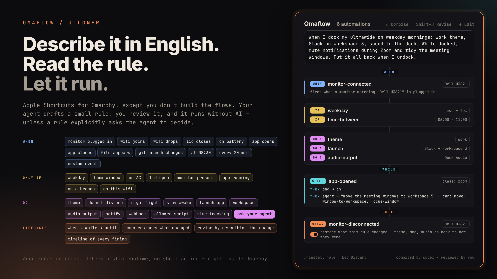

# Omaflow

Apple Shortcuts, for [Omarchy](https://omarchy.org). Except you don't build the flows. You describe them, an agent writes the rule, and you review it before anything runs.

> "When I dock my ultrawide on weekday mornings, switch to my work theme and open Slack on workspace 3."

Codex, Claude Code, or Grok turns that into a small JSON rule. Most rules then run without AI; an explicit agent action can instead ask the configured agent to choose window targets at trigger time. All your automations live in one place. Browse them, dry-run them, disable them, and read the timeline that explains every firing. Rules are plain files, so you can inspect, test, and move them to another machine.



## Requirements

- Omarchy 4 with `omarchy-shell`
- One agent CLI, signed in: [Codex](https://github.com/openai/codex), [Claude Code](https://claude.com/claude-code), or Grok. Used to write rules and by explicit agent actions.
- `ruby`, `hyprctl`, `gdbus`, `nmcli`, `pactl` (all on stock Omarchy)

## Install

Install Omaflow from the Omarchy plugin manager:

```bash
omarchy plugin add https://github.com/jlugner/omarchy-omaflow.git --enable
```

That is the whole installation: the engine and the overlay start with the shell, and `~/.config/omarchy/plugins/jesperlugner.omaflow/bin/omaflow` opens the inspector right away. A one-time notification points to the optional setup step.

Optionally, run setup to add three conveniences — an `omaflow` link in `~/.local/bin`, an Automations entry in the Omarchy menu, and the `Super+Shift+U` hotkey. Each step asks before writing, and nothing else depends on them:

```bash
~/.config/omarchy/plugins/jesperlugner.omaflow/bin/omaflow setup
```

After the CLI link exists, the command is `omaflow setup`.

To uninstall, run `omarchy plugin remove jesperlugner.omaflow`. If you ran setup, also delete the `omaflow` link in `~/.local/bin` and remove the omaflow marker blocks from `~/.config/omarchy/extensions/omarchy-menu.jsonc` and your Hyprland bindings file. Rules live in `~/.config/omaflow/`; delete that and `~/.local/state/omaflow/` for a full cleanup.

## Use

Open the inspector and describe an automation. A preview shows the exact trigger, conditions, and actions. `Return` installs it, `Esc` throws it away. Nothing runs that you haven't read.

To change a rule, select it, describe the change ("also turn off nightlight", "only on weekdays"), and press `Shift+Return`. The agent revises that rule and the preview shows exactly what changed before you apply it.

Build rules by hand in the editor: `Ctrl+N` starts a new visual chain, while `e` edits the selected rule. Saving opens the same staged preview for final confirmation.

| Key | Action |
|-----|--------|
| `Return` | Compile the description, or install the previewed rule |
| `Shift+Return` | Revise the selected rule with the description |
| `Alt+Return` | Run the selected rule now |
| `Ctrl+Return` | Dry-run: log what would execute |
| `Ctrl+E` | Enable / disable |
| `Ctrl+N` | Create a rule in the visual editor |
| `e` | Edit the selected rule |
| `Alt+Delete` | Delete (confirmed) |
| `Up` / `Down` | Move the selection |
| `Esc` | Cancel a running compile / discard preview / clear / close |

The activity timeline answers "why did my theme just change?" Every firing logs which trigger matched and what ran.

Everything works from the CLI too:

```bash
omaflow setup [--yes]
omaflow author "on battery, enable dnd and dim ambitions"
omaflow revise <id> "<change>"
omaflow stage-file <path> · describe <id>
omaflow stage show|accept|reject
omaflow list · run <id> [--dry-run] · enable|disable|disarm|delete <id>
omaflow log · revert <exec-id> · agent [codex|claude|grok|auto] · poke
omaflow trigger <name> [key=value ...]
omaflow scripts [list | add <name> <absolute-path> [description] | remove <name>]
omaflow webhooks [add <name> <url> [format] | remove <name>]
```

## What rules can do

**Triggers:** manual · time of day (+ weekdays) · every N minutes · lid opened/closed · monitor connected/disconnected · app opened/closed · wifi connected (by name, any, or never seen before) / disconnected · switched to AC/battery · file or folder appears in a watched directory · a repo switches branch · named custom events.

**Conditions:** time window · weekday · on AC/battery · lid open/closed · monitor present · app running · repo is on a branch · HEY has events today · on a given wifi.

**Actions:** set theme · DND · nightlight · stay-awake · launch app (optionally on a workspace) · switch workspace · set audio output · run an allowed script · send a notification · post to a webhook · start, stop, or switch a HEY time track · show today's HEY agenda · ask an agent to choose window targets within a capability envelope.

An agent action sees the current window addresses, classes, titles, and workspaces, then may propose only the verbs granted in the rule: close, focus, move to workspace, or notify. Omaflow validates the whole proposal against that window list and capability envelope before executing anything; one invalid operation rejects all of it.

Webhooks reach anything with an inbox: Slack, Discord, [ntfy](https://ntfy.sh) on your phone, Home Assistant. Rules never contain URLs. They point at named endpoints you add yourself, so a rule can only send where you've allowed:

```bash
omaflow webhooks add team-slack https://hooks.slack.com/services/… slack
omaflow webhooks add phone https://ntfy.sh/your-topic ntfy
```

Formats shape the body per target: `slack`, `discord`, `ntfy`, `raw`, or a default `json` envelope.

### Until

An optional `until` block gives one rule an opening and a closing half. The rule arms only after its opening actions succeed; the matching `until` event later runs the closing actions once and disarms. Conditions and cooldowns gate the opening, never the escape hatch. An interval `until` is a one-shot timeout measured from the latest successful opening fire.

Set `"revert": true` in the `until` block to restore the revertible opening actions to the state captured immediately before the latest successful opening run. This gives true enter-state/leave-state behavior: if Zoom opening turns DND on, Zoom closing puts DND back to off when it was off, but leaves it on when it was already on. An until may contain `revert`, 1–10 closing actions, or both; restoration runs before closing actions, and an expired or missing snapshot is logged and skipped without preventing the actions or disarm.

```json
{"schemaVersion":1,"id":"office-tracking","name":"Office tracking","enabled":true,"trigger":{"type":"wifi-connected","match":{"ssid":"Office"}},"actions":[{"type":"hey-timetrack","mode":"start","category":"Work"}],"until":{"trigger":{"type":"wifi-disconnected"},"actions":[{"type":"hey-timetrack","mode":"stop"}]},"source":"start tracking on office wifi until it disconnects"}
```

Run `omaflow disarm office-tracking` to cancel an armed lifecycle without running its closing actions.

### While

A rule with an `until` can also carry `while`: up to five reactions, each a trigger and actions, that are live only between the opening fire and the closing event. A reaction runs its actions whenever its trigger matches, without arming, disarming, or checking the rule's conditions and cooldown. An interval reaction repeats every N minutes for as long as the rule is armed, paced on its own. If one event matches both a reaction and the `until`, the `until` wins and the rule closes.

WHEN → WHILE → UNTIL turns the office example into one rule: track the current branch on arrival, follow branch switches and nudge you every twenty minutes while you're there, stop when you leave.

```json
{"schemaVersion":1,"id":"office-branch-tracking","name":"Office branch tracking","enabled":true,"trigger":{"type":"wifi-connected","match":{"ssid":"Office"}},"actions":[{"type":"hey-timetrack","mode":"switch","categoryFromRepo":"~/Documents/code/project"}],"while":[{"trigger":{"type":"git-branch-changed","repo":"~/Documents/code/project"},"actions":[{"type":"hey-timetrack","mode":"switch","categoryFromRepo":"~/Documents/code/project"}]},{"trigger":{"type":"interval","minutes":20},"actions":[{"type":"notify","title":"20-20-20","message":"Look away for 20 seconds."}]}],"until":{"trigger":{"type":"wifi-disconnected"},"actions":[{"type":"hey-timetrack","mode":"stop"}]},"source":"on office wifi track the current branch, switch when it changes, remind me to look away every 20 minutes, stop when I leave"}
```

The repo is watched only while the rule is armed, so a rule like this costs nothing when you're not at the office.

### HEY

Install the HEY CLI and sign in once:

```bash
omarchy pkg aur add hey-cli
hey auth login
```

The office lifecycle above starts and stops tracking in one rule. A separate branch rule can file the active track under each branch as it changes:

```json
{"schemaVersion":1,"id":"branch-switch","name":"Track current branch","enabled":true,"trigger":{"type":"git-branch-changed","repo":"~/Documents/code/project"},"actions":[{"type":"hey-timetrack","mode":"switch","categoryFromRepo":"~/Documents/code/project"}],"source":"switch time tracking with the current branch"}
```

An 08:00 agenda flow can stay quiet on empty days:

```json
{"schemaVersion":1,"id":"morning-agenda","name":"Morning agenda","enabled":true,"trigger":{"type":"time","at":"08:00"},"actions":[{"type":"hey-agenda","title":"Today","skipWhenEmpty":true}],"source":"show my HEY agenda at 8"}
```

`hey-events` gates a rule on today's event count. HEY actions contact the service when the rule fires, so they need network access and a valid HEY login. Time-track actions are not revertible.

Fire a custom event with `omaflow trigger deploy-done env=prod`. Notify and webhook messages can use `{{trigger}}` plus event fields such as `{{class}}`, `{{title}}`, `{{env}}`, `{{ssid}}`, `{{name}}`, `{{source}}`, and `{{at}}`. Unknown placeholders become empty strings.

For example, opening Slack can enable DND, or closing Zoom can send a notification.

File and folder rules react instantly through inotify when available, with the 45-second heartbeat as a fallback. Git HEAD changes ride the same inotify hotline. Dot-files are skipped; browser partial downloads are best filtered with `match.name`, such as `.pdf`.

There is no shell action, on purpose. The agent can only emit typed, allowlisted actions, and every rule is validated against your actual machine (the theme exists, the app is installed) at install time and again before every run.

### Named scripts

A script action contains only a name. It cannot contain a path, arguments, environment values, or shell text. Add one executable to the user allowlist explicitly:

```bash
omaflow scripts add refresh-desk /home/me/.local/bin/refresh-desk "Refresh the desk hardware"
omaflow scripts list
```

Omaflow stores the canonical absolute path in `~/.config/omaflow/scripts.json`. User-approved executables and their containing directories must be owned by you or root and not writable by a group/anyone. Omaflow validates the name and availability again before every run, then executes the file directly with a 30-second timeout. Put fixed arguments in a wrapper script rather than in a rule. Script actions are not revertible; whitelisting a script grants rules that exact capability.

Two packaged scripts, `lock-fingerprint-enable` and `lock-fingerprint-disable`, control temporary fingerprint suppression through a compatible lock service's versioned IPC capability. They support a lid-close rule with a lid-open `until` action without giving agent-authored JSON access to PAM or privileged files. The lock remains responsible for physical lid reconciliation and recovery. Validation rejects these actions unless capability version 1 is currently available, and Omaflow never installs or modifies a lock plugin or PAM configuration.

## How it works

- Rules are one JSON file each in `~/.config/omaflow/rules/`, portable config that syncs like your dotfiles. Each rule keeps your original request in its `source` field.
- A small shell service forwards change signals (Hyprland monitor events, UPower lid changes, `nmcli monitor`, power state, and a 45s heartbeat) to `bin/omaflow-eval`, a state-diff engine: it re-reads reality, diffs against its last snapshot, and fires matching rules. Duplicate signals cost nothing. First run stores a hardware baseline and fires no hardware events.
- `bin/omaflow-run` executes actions through existing Omarchy surfaces (`omarchy theme set`, shell IPC, `hyprctl`, `pactl`). An agent action uses the same tool-less agent runner as authoring, then validates its proposed operations before dispatch. Revertible actions are snapshotted first and rolled back after failure. `omaflow revert <exec-id>` rejects runs with nothing revertible and reports mixed reversible/irreversible runs as partial.
- Authoring hands the agent the schema plus your machine's real inventory (themes, monitors, sinks, apps, allowed script names), validates the result, and stages it. `stage accept` is the only way into the rules directory.
- Agent choice: `--agent` flag > `OMAFLOW_AGENT` > `omaflow agent <backend>` > Omarchy's default agent > first installed of codex/claude/grok.

Nothing leaves your machine at trigger time unless a webhook or agent action explicitly says so. Window titles live in `~/.local/state/omaflow/domains.json`, which is written with mode `0600`. Authoring sends your description and the inventory above to your agent; agent actions send their task and bounded window context. Both run with tools, MCP servers, and web access turned off as far as each CLI allows, plus a hard timeout. The validator also rejects option-shaped strings (leading dashes, control characters) in any field that reaches a command line.

## Verify

```bash
omarchy plugin validate ~/.config/omarchy/plugins/jesperlugner.omaflow
~/.config/omarchy/plugins/jesperlugner.omaflow/tests/test-validate.sh
~/.config/omarchy/plugins/jesperlugner.omaflow/tests/test-eval.sh
~/.config/omarchy/plugins/jesperlugner.omaflow/tests/test-hey.sh
~/.config/omarchy/plugins/jesperlugner.omaflow/tests/test-author.sh
~/.config/omarchy/plugins/jesperlugner.omaflow/tests/test-editor.sh
~/.config/omarchy/plugins/jesperlugner.omaflow/tests/test-agent-action.sh
~/.config/omarchy/plugins/jesperlugner.omaflow/tests/test-hardening.sh
~/.config/omarchy/plugins/jesperlugner.omaflow/tests/test-setup.sh
~/.config/omarchy/plugins/jesperlugner.omaflow/tests/test-scripts.sh
```

The same checks run in CI on every push. Tests fake every system surface, including the agent, so they run anywhere.

## License

[MIT](LICENSE)
