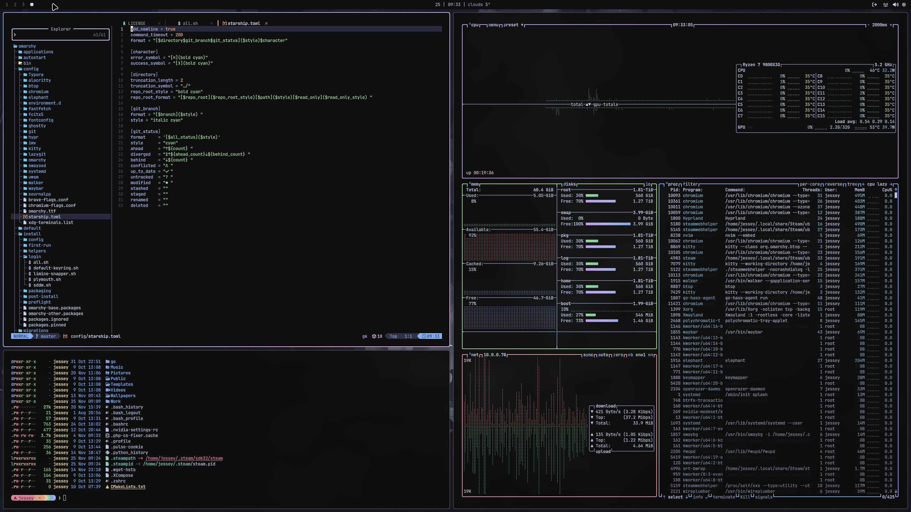
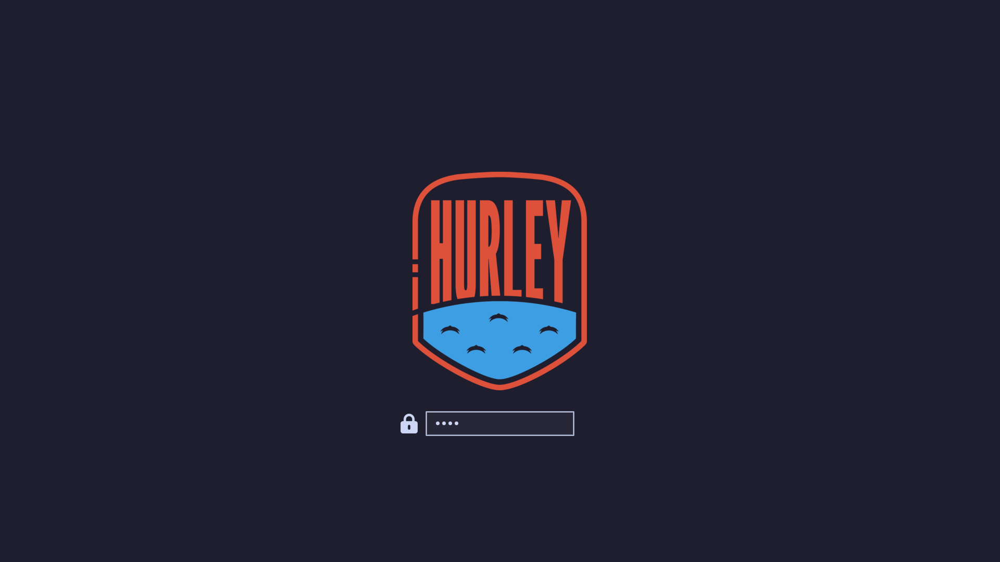
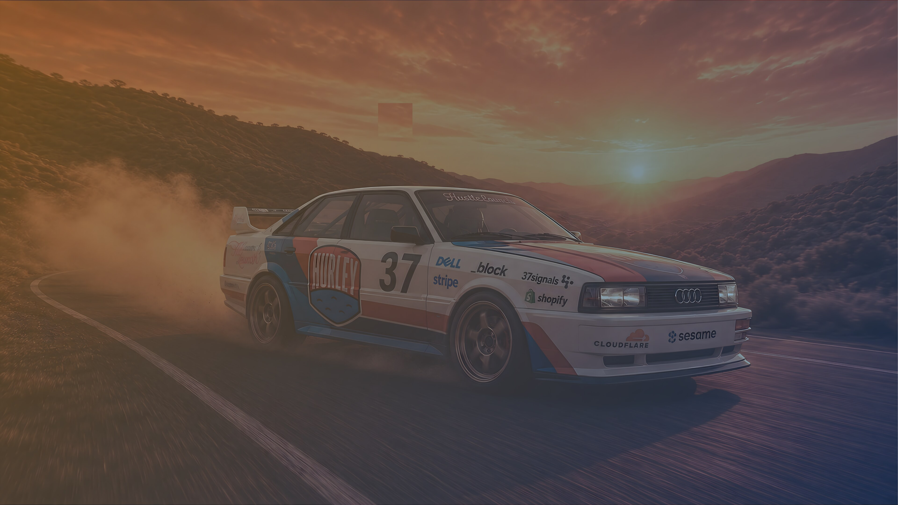
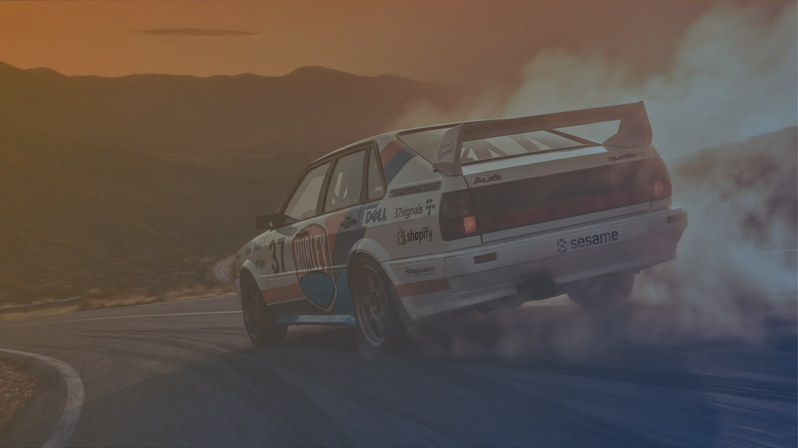
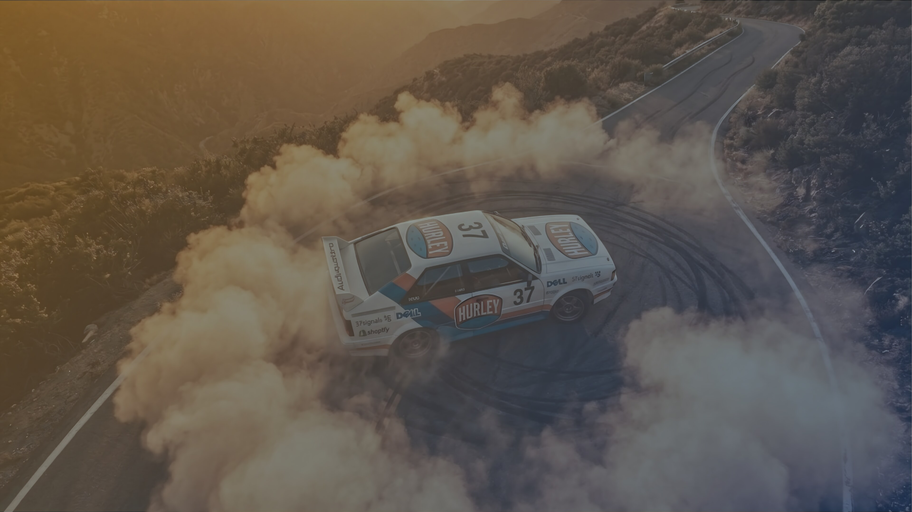
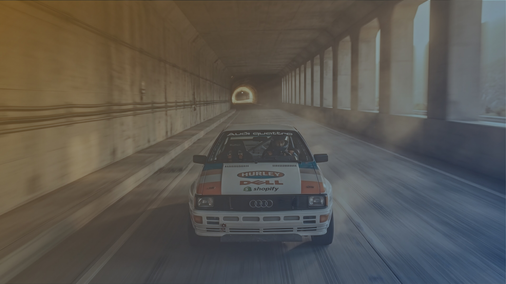
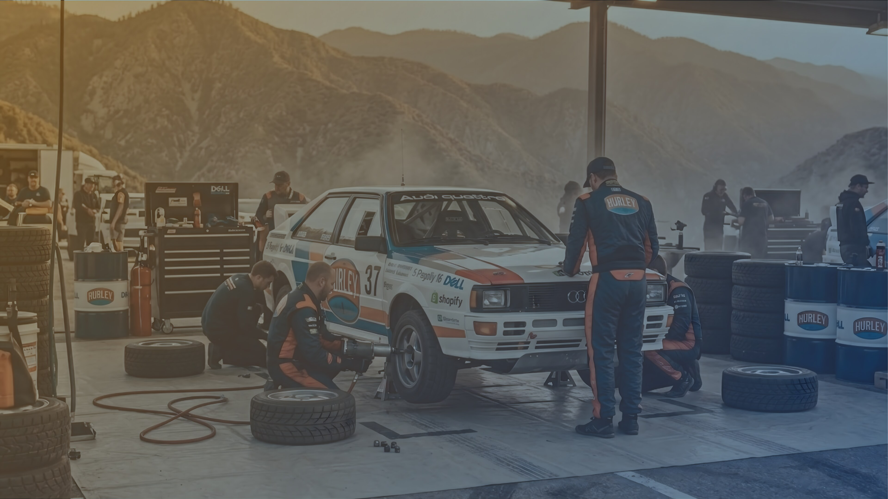
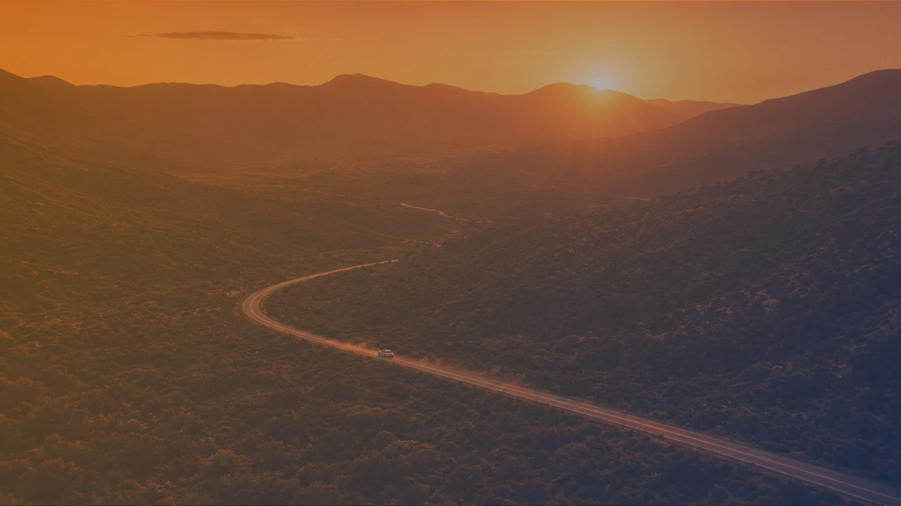

# Hurleyus

Catppuccin Mocha for Omarchy, dressed in Hurley rally livery. Mocha everywhere the palette reaches — terminals, editors, shell — with the Audi quattro artwork carrying the rest.

Forked from the stock Omarchy Catppuccin theme. Part of https://github.com/michaelmonetized/dotfiles-quattro.



## Screenshots

| Desktop | Boot unlock |
| --- | --- |
|  |  |

## Wallpapers

Seven 4K walls, all pre-darkened so the bar and terminals stay readable. Cycle with `omarchy theme bg next` or pick one in Omarchy menu → Style → Background.

| 01 · Canyon run | 02 · Hairpin |
| --- | --- |
|  |  |
| **03 · The jump** | **04 · Donuts** |
|  |  |
| **05 · Tunnel blast** | **06 · Service park** |
|  |  |
| **07 · Last light** | |
|  | |

## Install

```bash
omarchy theme install https://github.com/michaelmonetized/omarchy-hurleyus-theme
```

Or Omarchy menu → Install → Style → Theme with that URL.

Optional branding after install:

```bash
cp ~/.config/omarchy/themes/hurleyus/branding/about.txt ~/.config/omarchy/branding/about.txt
cp ~/.config/omarchy/themes/hurleyus/branding/screensaver.txt ~/.config/omarchy/branding/screensaver.txt
```

Boot unlock (Plymouth + SDDM), same path Lumon uses:

```bash
omarchy plymouth set by theme hurleyus
```

Or Omarchy menu → Style → Unlock → Hurleyus.

Asahi U-Boot splash (the compiled-in 160×160 logo inside `u-boot-nodtb.bin`):

```bash
~/.config/omarchy/themes/hurleyus/branding/install-uboot-logo.sh
```

## What's in here

| File | What it does |
| --- | --- |
| `colors.toml` | Catppuccin Mocha. Omarchy generates Foot, Ghostty, Kitty, Alacritty, btop, Chromium, the shell, and the rest from this. |
| `backgrounds/` | 7× 3840×2160 JPEG walls |
| `branding/` | About + screensaver ASCII, logo, U-Boot splash |
| `hyprland.lua` | 20px rounding, 20px gaps, Mocha borders |
| `neovim.lua` | Catppuccin |
| `vscode.json` | Catppuccin Mocha |
| `icons.theme` | Yaru-purple |
| `preview.png` | Theme picker preview |
| `unlock.png` | Plymouth / SDDM boot-unlock logo |
| `preview-unlock.png` | Style → Unlock picker preview |

## Customize

This is the jump-off point. Change `colors.toml`, drop art in `backgrounds/` (jpg, png, webp all work), tweak rounding in `hyprland.lua`, swap branding, then:

```bash
omarchy theme set hurleyus
```

Do not ship Foot/Ghostty/Alacritty palettes in the theme. Those files block Omarchy's templates and you get a black terminal. `colors.toml` is the palette.

## Credits

[Catppuccin](https://github.com/catppuccin/catppuccin). [Omarchy](https://omarchy.org).
